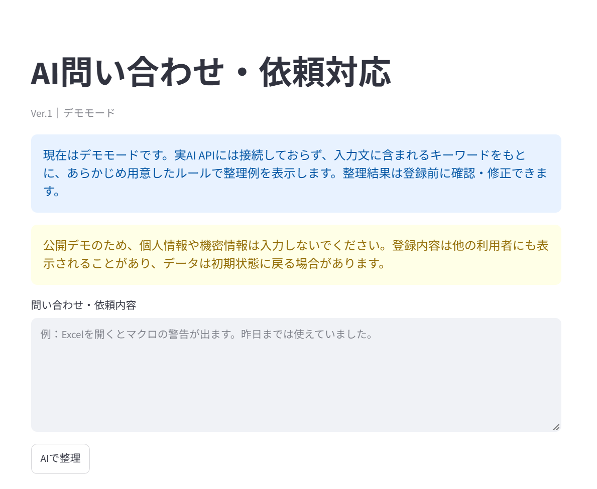
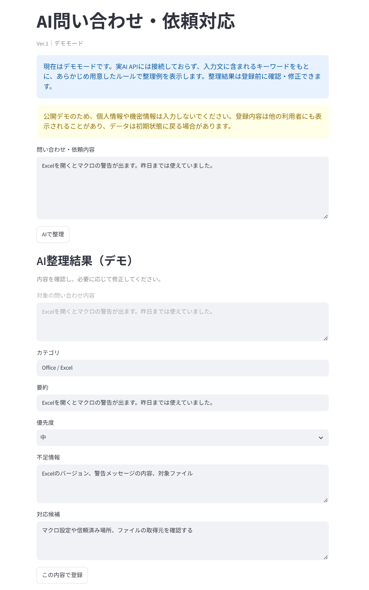
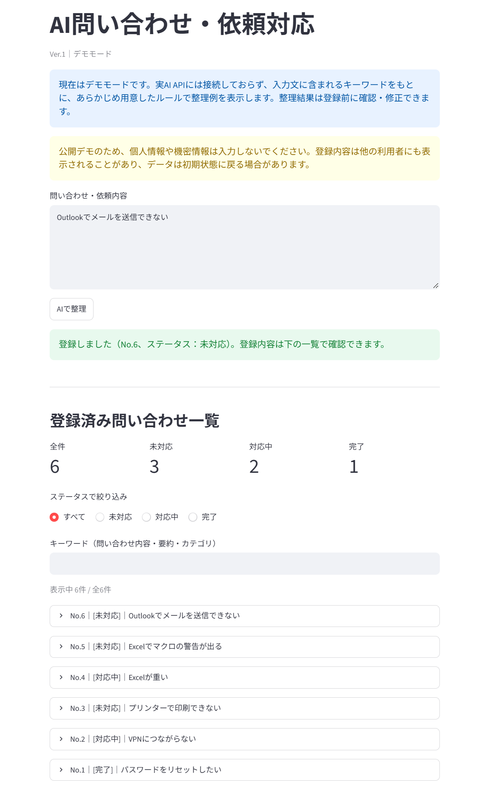
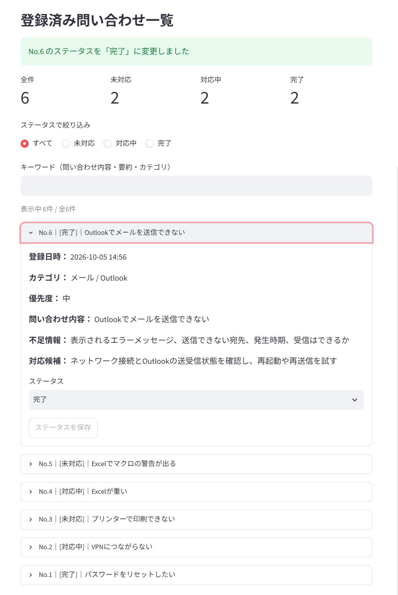

# AI問い合わせ・依頼対応（AI Workflow Helpdesk）

社内の問い合わせ・依頼を自由文で受け付け、整理・確認・登録・対応状況の管理までを1画面で行う業務支援アプリです。



## アプリ概要

問い合わせ文を入力すると、カテゴリ・要約・優先度・不足情報・対応候補の整理例を表示します。
担当者がその内容を確認・修正（Human Review）してから登録し、一覧で「未対応／対応中／完了」を管理します。

> **現在はデモモードです。** 実AI APIには接続しておらず、入力文のキーワードに基づくルールベースの整理例を表示します。

## 解決したい課題

- 問い合わせが自由文で届くため、内容の把握や担当判断に時間がかかる
- 対応に必要な情報（環境、エラー内容など）が不足していて、聞き返しが発生する
- 対応状況がメールやチャットに散らばり、未対応の案件を把握しにくい

## 利用フロー

1. 問い合わせ・依頼内容を自由文で入力
2. 「AIで整理」で整理例を表示（現在はデモモード）
3. 担当者が内容を確認・修正（Human Review）
4. 「この内容で登録」でデータベースに保存
5. 一覧でステータスを更新し、絞り込み・検索で案件を探す

| Human Review | 登録直後 |
|---|---|
|  |  |

## 主な機能

- **問い合わせ入力**：自由文で入力。空欄のまま整理しようとすると警告を表示
- **整理例の表示（デモ）**：カテゴリ／要約／優先度／不足情報／対応候補
- **Human Review**：整理結果を登録前に編集可能。対象の問い合わせ文も並べて表示
- **SQLite保存**：登録日時（日本時間）とともに保存
- **問い合わせ一覧**：新しい順に表示。各案件の詳細は展開して確認
- **ステータス管理**：未対応／対応中／完了。変更がないときは保存ボタンを無効化
- **ステータス別件数**：全件・未対応・対応中・完了の件数を表示
- **絞り込み・検索**：ステータスで絞り込み、問い合わせ内容・要約・カテゴリをキーワード検索



## デモモードについて

整理処理は `analyze_inquiry()` を入口にしており、現在はルールベースの `analyze_demo()` に振り分けています。

- 入力に「Excel」（大文字小文字を区別しない）や「エクセル」が含まれる場合は、Excel向けの整理例を表示
  - さらに「マクロ」が含まれる場合は、マクロ警告向けの整理例を表示
- それ以外は汎用の整理例を表示
- 要約は入力文の1行目をもとに作成（長い場合は省略）

画面側は `analyze_inquiry()` だけを呼び出す構造にしているため、将来は画面を変えずに実AIモードを追加できます。

## 技術構成

| 項目 | 内容 |
|---|---|
| 言語 | Python 3.11 |
| UI | Streamlit |
| データベース | SQLite（Python標準の `sqlite3`） |
| 開発支援 | Claude Code |

## 工夫したポイント

- **Human Reviewを前提にした設計**：整理結果をそのまま登録せず、人が確認・修正してから保存する流れにしました。業務で使うときの誤登録を防ぐためです。
- **分析処理の差し替えやすさ**：画面から呼ぶ関数を `analyze_inquiry()` に一本化し、デモ用と将来の実AI用を切り替えられる構造にしました。
- **操作ミスを防ぐ工夫**：登録後はフォームを閉じて二重登録を防止しました。ステータスは変更があったときだけ保存できます。
- **データを安全に扱う工夫**：SQLはプレースホルダ（`?`）で値を渡しています。日時はタイムゾーン付きで保存し、画面では `2026-10-05 12:30` 形式で表示します。

## 開発プロセス

Claude Code を開発支援ツールとして活用しながら、段階的に開発しました。

課題設定、要件整理、画面や処理フローの設計は自分で行いました。Claude Code から出た提案は採用するかどうかを自分で判断し、変更内容は `git diff` で確認しました。そのうえでブラウザで実際に操作して動作を確かめ、コミットするかどうかも自分で判断しています。

Claude Code は、設計案や改善案の提示、Pythonコードの実装支援、コードレビュー、文法チェック、変更内容の説明に活用しました。

各段階では「レビュー → 修正範囲の決定 → 実装 → 差分確認 → 画面での動作確認 → コミット」を繰り返し、機能や修正を小さな単位に分けてコミットしています（初期デモ → SQLite保存 → 一覧・ステータス管理 → 分析モードの抽象化 → 絞り込み・検索 → Ver.1の仕上げ）。

## ローカルでの起動方法

Python 3.11 以上が必要です。

### Windows（PowerShell）

```powershell
git clone https://github.com/ttomobilead-dot/ai-workflow-helpdesk.git
cd ai-workflow-helpdesk
python -m venv .venv
.\.venv\Scripts\Activate.ps1
pip install -r requirements.txt
streamlit run app.py
```

実行ポリシーの設定などで `Activate.ps1` を実行できない場合は、仮想環境を有効化せずに次のコマンドでも起動できます。

```powershell
.\.venv\Scripts\pip.exe install -r requirements.txt
.\.venv\Scripts\streamlit.exe run app.py
```

### macOS / Linux

```bash
git clone https://github.com/ttomobilead-dot/ai-workflow-helpdesk.git
cd ai-workflow-helpdesk
python3 -m venv .venv
source .venv/bin/activate
pip install -r requirements.txt
streamlit run app.py
```

初回起動時に `helpdesk.db` が自動で作成されます（Git管理の対象外です）。DBが空の場合は、サンプルの問い合わせ6件が自動で登録されます。

公開デモ環境のデータは永続保存を前提としておらず、再起動などで初期状態に戻ることがあります。登録内容は他の利用者にも表示されるため、個人情報や機密情報は入力しないでください。

## 今後の拡張予定（Ver.2）

以下は未実装で、今後の追加を検討している機能です。

- 実AI APIを使った整理モードの追加
- 登録済みの問い合わせの編集・削除
- 検索対象の拡張、並び替え
